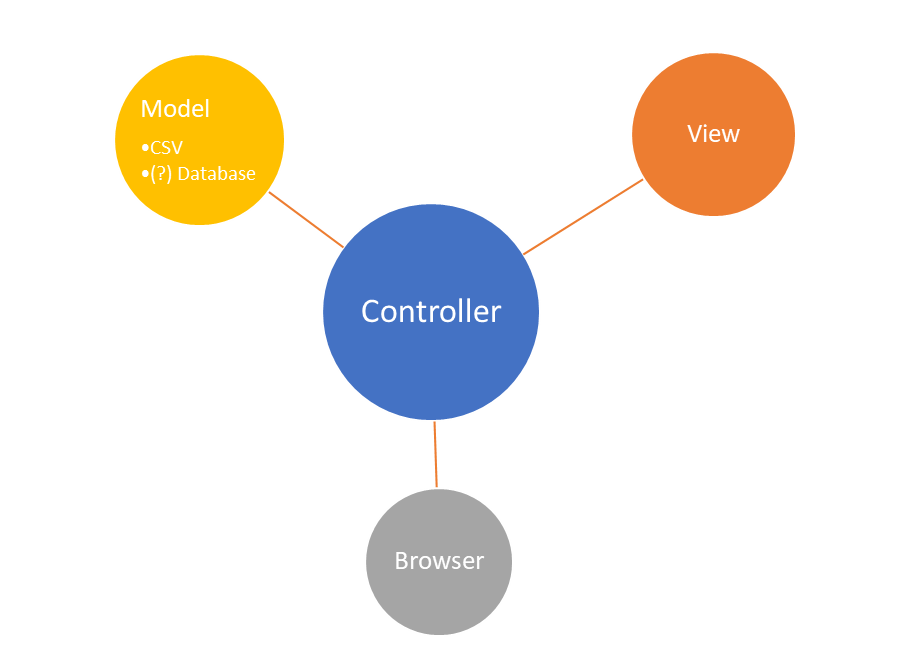

# Betriebsstellen

Hallo!  
This app allows you to type a shortname of a rail station and get its data in JSON as a response.
It's nothing more than simple CSV search -> JSON Spring Boot app.

It's hosted on Heroku:  
(it may take up to 30 sec to launch it for the first time, because Heroku freezes free aps after 30 minutes of inactivity)  
<https://betriebsstellen.herokuapp.com/>


To show my outstanding coding skills I used a really big CSV file (more than 23089 positions), which you can download from here:

Betriebsstellenverzeichnis (Stand 04/2018)
<https://data.deutschebahn.com/dataset/data-betriebsstellen.html>
```
Langbeschreibung
In den veröffentlichten Daten ist für jede Betriebsstelle definiert:

* Abk: Abkürzung entsprechend Richtlinie 100.0001, die sich aus Ort und Art zusammensetzt. Eine gute Erklärung findet man in der Wikipedia
* Name: Langname, z.B. Frankfurt (Main) Galluswarte
* Kurzname: Kurzname, z.B. Ffm Galluswarte
* Typ: Zur Abk. gehörende Bahnstellenarten, z.B. Bf
* Betr-Zust: Betriebszustand
* Primary location code: Eindeutige Nr. innerhalb Europa, z.B. DE 13273
* UIC: UIC RICS code, z.B. 0080
* RB: Zuständiger Regionalbereich Netz, nur für Örtlichkeiten der DB Netz AG, z.B. 5
* gültig von im Format YYYYMMDD, z.B. 20081214
* gültig bis im Format YYYYMMDD. Bleibt frei, wenn keine Begrenzung vorliegt.
* Netz-Key: Eindeutiger unveränderlicher Schlüssel für alle Infrastrukturstellen, z.B. 117044
* Fpl-rel: Fahrplanrelevanz – dies ist eine im Fahrplan bestellbare Örtlichkeit – im Ausland nur ausnahmsweise gekennzeichnet, z.B. J
* Fpl-Gr: Fahrplanbearbeitungsgrenze – im Ausland nur ausnahmsweise gekennzeichnet, z.B. N
```


## Design Pattern

I used Spring-MVC-Design-Pattern

